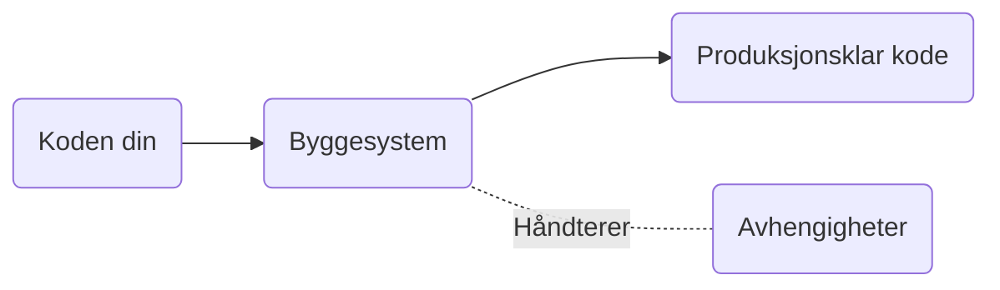

import { RelevantLinks } from "../../src/components/RelevantLinks/RelevantLinks.tsx";
import { Tooltip } from "../../src/components/Tooltip/Tooltip.tsx";

# Byggesystem
Et byggesystem håndterer bygging/kompilering av koden din, avhengigheter den måtte ha, og andre lignende oppgaver.

### Hvorfor bruke et byggesystem?
Du har kanskje laget ganske enkle applikasjoner hittil? Du vil nok legge merke til at kommandoene for å <Tooltip hint="Å kompilere kode betyr overforenklet å oversette koden fra tekst vi kan lese, til instrukser maskinen kan utføre.">kompilere</Tooltip> blir stadig mer komplekse når du har flere filer. Det er flere grunner til å bruke et byggesystem:
- Prosjektet har mange kodefiler som skal bygges/kompileres.
- Prosjektet avhenger av eksterne avhengigheter som f.eks web server logikk eller sikkerhets-algoritmer. Disse avhengighetene kan fort bli litt tuklete å håndtere manuelt.
- Håndtering av versjonsnummer for prosjektet
- Enkel måte å kjøre tester på. De vanligste testene er de vi kaller unit tester.
- Kunne bruke plugins og andre hjelpemidler, for å analysere og jobbe på koden din.

Byggesystem forenkler disse oppgavene. Mange byggesystem vil hente ned avhengigheter automatisk når koden bygges.

### Oppgaver byggesystem ofte løser
- Hente avhengigheter koden din måtte ha (inkludert "transitive avhengigheter" om nødvendig). Dette kan f.eks være biblioteker du bruker for å raskere sette opp web servere slik at du fortere kan komme i gang. Ofte hentes disse direkte fra nettet, men kan også hentes fra et selskaps interne "avhengighets-database".
- Kompilere kode.
- Kjøre tester på koden din om du har skrevet tester.
- Bygge kjørbar fil eller andre artifakter. F.eks en exe-fil på Windows system, eller jar-fil om du bygger på Java plattformen.
- (Ofte) en måte å kjøre prosjektet ditt enkelt og raskt for å feilsøke.
- Håndtering av versjonsnummer. Dette inkluderer metadataen, men ofte også enkle måter å oppgradere disse på.
- Andre konfigurerbare oppgaver du muligens ønsker å løse. Dette kan inkludere å bygge kode på spesielle måter, plugins, liste ut avhengigheter, og lignende. I enkelte tilfeller kan du bruke plugins i byggesystem for å laste opp koden din til serveren den skal kjøres på (gitt at det er en backend applikasjon).

:::info Transitive avhengigheter?
Du vil før eller siden komme over begrepet "transitive dependencies", eller transitive avhengigheter. Hva betyr dette? Det er så enkelt som avhengigheter til avhengighetene dine! Om du tar inn avhengighet A1 som avhenger av B1, så hentes begge inn.
:::

### Eksempler på byggesystem
- Maven (Java-baserte prosjekter)
- Gradle (stort sett Java-baserte prosjekter)
- NPM - Node Package Manager (nettsider og Node.js applikasjoner)
- Cargo (Rust)
- CMake (C++)

### Ressurser
<RelevantLinks
  videos={[
    {
      title: "Hvorfor vi skriver Unit Tester og eksempler på hvordan de ser ut (engelsk)",
      url: "https://www.freecodecamp.org/news/unit-tests-explained/",
    },
  ]}
/>
