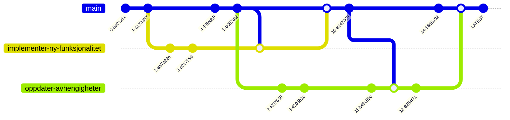

import GIT from "../static/img/git.svg";

# Git

  <GIT style={{ width: "100%", height: "100%" }} />

Git er et distribuert versjonskontrollsystem designet for å håndtere alt fra små til veldig store prosjekter med hastighet og effektivitet.

Git lar deg holde oversikt over endringer i filer, slik at du har en historie over hva som er gjort, og har muligheten til å gå tilbake til tidligere versjoner av disse filene om nødvendig.

Hvis du skal jobbe sammen med andre på et prosjekt, er Git et must for å sikre at du ikke skriver over hverandres endringer.

## Visualisert

Som du ser i visualiseringen, kan man trygt _branch'e_ ut ifra hoved-branchen for å gjøre isolerte endringer,
for så å _merge'e_ branchen tilbake til hovedbranchen etterpå. Det går fint an å ha flere brancher som er basert på samme branch, eller at det skjer endringer i branchen imens du jobber på din egen branch.

I teams vil det som regel være en review-prosess på alle branches som skal merges inn i hovedbranchen, for å sikre at koden som merges inn er av god kvalitet. Dette er en viktig del av kvalitetssikringen i et prosjekt.
