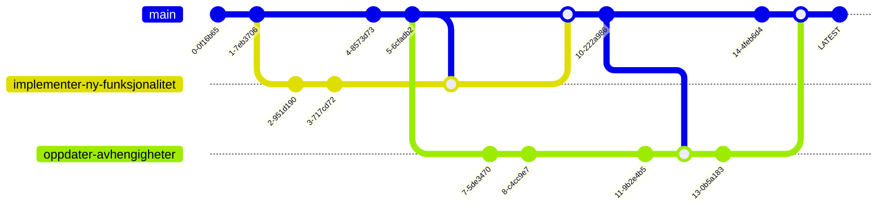

import { RelevantLinks } from "../../src/components/RelevantLinks/RelevantLinks.tsx";
import GIT from "../../static/img/git.svg";

# Git

  <GIT style={{ width: "100%", height: "100%" }} />

Git er et distribuert versjonskontrollsystem designet for å håndtere alt fra små til veldig store prosjekter med hastighet og effektivitet.

Git lar deg holde oversikt over endringer i filer, slik at du har en historie over hva som er gjort, og har muligheten til å gå tilbake til tidligere versjoner av disse filene om nødvendig.

Hvis du skal jobbe sammen med andre på et prosjekt, er Git et must for å sikre at du ikke skriver over hverandres endringer.

## Visualisert

Som du ser i visualiseringen, kan man trygt _branch'e_ ut ifra hoved-branchen (**main**) for å gjøre isolerte endringer,
for så å _merge'e_ branchen tilbake til hovedbranchen etterpå. Det går fint an å ha flere brancher som er basert på samme branch, eller at det skjer endringer i branchen imens du jobber på din egen branch.

I teams vil det som regel være en review-prosess på alle branches som skal merges inn i hovedbranchen, for å sikre at koden som merges inn er av god kvalitet. Dette er en viktig del av kvalitetssikringen i et prosjekt.

## De viktigste kommandoene

Hvis du er komfortabel med følgende kommandoer, er du godt rustet til å bruke Git i prosjektene dine.

### `git init`

Oppretter et nytt git-repository i mappen du står i.

### `git clone`

Kloner et eksisterende git-repository til mappen du står i.

### `git add`

Legger til filer i git-repositoryet ditt. Du kan legge til enkeltfiler, eller hele mapper.

### `git commit`

Lager en ny versjon av filene du har lagt til med `git add`. Du må skrive en beskjed som beskriver hva du har gjort siden sist.

### `git push`

Sender endringene du har gjort til et eksternt repository. Dette kan være et repository på GitHub, GitLab, BitBucket, eller et annet sted.

### `git pull`

Henter endringer fra et eksternt repository. Dette kan være et repository på GitHub, GitLab, BitBucket, eller et annet sted.

### `git branch`

Lager en ny branch. Du kan også bruke `git checkout -b <branch-navn>` for å lage en ny branch og bytte til den.

### `git checkout`

Bytter branch. Du kan også bruke `git checkout -b <branch-navn>` for å lage en ny branch og bytte til den.

### `git merge`

Slår sammen en branch inn i en annen. Du må være på den branchen du vil slå sammen til.

### `git status`

Viser statusen til git-repositoryet ditt. Her kan du se hvilke filer som er endret, hvilke filer som er lagt til, og hvilke filer som er slettet.

## Ressurser

<RelevantLinks
  documentation={[
    {
      title: "Git Dokumentasjon",
      url: "https://git-scm.com/doc",
    },
  ]}
  videos={[
    {
      title: "Git and Github for Beginners Tutorial",
      url: "https://www.youtube.com/watch?v=tRZGeaHPoaw",
    },
  ]}
/>
