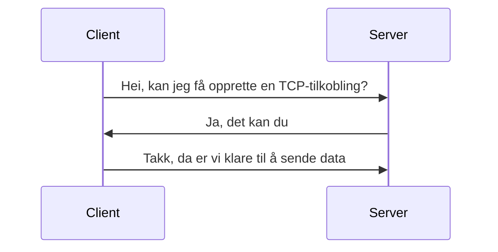

import { RelevantLinks } from "../../src/components/RelevantLinks/RelevantLinks.tsx";

# Hvordan lastes en nettside?

> Basert på [Populating the page: how browsers work - MDN](https://developer.mozilla.org/en-US/docs/Web/Performance/How_browsers_work#Populating_the_page:_how_browsers_work).

Denne artikkelen satser på å gi deg en oversikt over hvordan en nettside faktisk laster innhold.
Dette er kjempenyttig kunnskap å ha når du skal optimalisere nettsider for ytelse.

## 1. Navigering

Det første steget for å laste inn en nettside er navigasjon. Dette kan skje på flere forskjellige måter, typisk sett:

- Bruker skriver inn en URL i adressefeltet
- Bruker klikker på en lenke
- Bruker trykker på frem/tilbake-knappen i nettleseren

Når nettleseren har en URL, må den finne ut hvilken server den skal sende en forespørsel til. Dette gjøres ved å slå opp domenenavnet i **DNS** (Domain Name System).

## 2. DNS lookup

Når nettleseren har URL-en, må den finne ut hvilken IP-adresse den skal sende en forespørsel til. Dette gjøres ved å slå opp domenenavnet i DNS.

En DNS server sin jobb er å ta imot et **`domene`**

:::info Eksempel
`example.com`
:::

og gi tilbake en IP-adresse

:::info Eksempel
`93.184.216.34`
:::

Nettleseren trenger IP-adressen for å kunne sende [forespørseler](./server-og-klient#forespørsel) til riktig server.

:::tip
Nettleseren må gjøre en DNS lookup for hver eneste ressurs som skal lastes inn på siden fra et nytt domene.
Dette inkluderer bilder, CSS-filer, JavaScript-filer, osv. Her er det mulig å spare tid for brukeren som utvikler ved å redusere antall domener som brukes på en side.
:::

## 3. TCP handshake

Før nettleseren kan be om innhold fra en server, må den opprette en **TCP-tilkobling** med serveren.

Dette gjøres ved bruk av 3 trinn:



### Hvorfor trenger vi TCP?

TCP er en del av det som kalles **transportlaget** i nettverksarkitekturen.
TCP sørger for at data blir sendt i riktig rekkefølge, og at det blir sendt på nytt dersom
det blir ødelagt eller mistet på veien. Dette er viktig for å kunne sende data pålitelig over internett.

Disse 3 trinnene kalles en **TCP handshake**, og må gjøres for hver eneste forespørsel som nettleseren sender til en server.

## 4. TLS negotiation

Hvis nettstedet bruker HTTPS, må nettleseren og serveren også forhandle om en **TLS-tilkobling**.
Denne "dialogen" produserer et **TLS-sertifikat** som nettleseren bruker for å bekrefte at serveren er den den utgir seg for å være.

<RelevantLinks
  videos={[
    {
      title:
        "Transport Layer Security (TLS) - Computerphile",
      url: "https://youtu.be/0TLDTodL7Lc?t=578",
    },
  ]}
/>

### Hvorfor trenger vi TLS?

TLS er viktig for å forhindre at en tredjepart kan lese eller endre på data som blir sendt mellom nettleseren og serveren.

## 5. Respons

På dette punktet har nettleseren gjort **8 rundturer** til serveren, og har enda ikke begynt å laste innhold.
Men nå som nettleseren har en TCP- og TLS-tilkobling, kan den endelig sende en **forespørsel** til serveren.

Nettleseren sender endelig en [`GET` forespørsel](./server-og-klient#forespørsel) til serveren for å be om innholdet på siden. Serveren svarer med en **respons**:

```html
<!DOCTYPE html>
<html lang="en-US">
  <head>
    <meta charset="UTF-8" />
    <title>My simple page</title>
    <link rel="stylesheet" href="styles.css" />
    <script src="myscript.js"></script>
  </head>
  <body>
    <h1 class="heading">My Page</h1>
    <p>
      A paragraph with a
      <a href="https://example.com/about">link</a>
    </p>
    <div>
      
    </div>
    <script src="anotherscript.js"></script>
  </body>
</html>
```

## 6. Parsing

Nå som nettleseren har fått responsen fra serveren, kan den lese innholdet og begynne å bygge
opp sin egne interne representasjon av siden (DOM & CSSOM) slik at den kan vise den til brukeren.

<RelevantLinks
  documentation={[
    {
      title: "How browsers work - Parsing (MDN)",
      url: "https://developer.mozilla.org/en-US/docs/Web/Performance/How_browsers_work#parsing",
    },
  ]}
/>

## 7. Rendering

:::info [SNL](https://snl.no/rendering_-_IT)

> _Rendering_ - prosessen som konverterer en datamodell til et bilde som kan vises på en skjerm

:::

Når nettleseren har bygget opp sin interne representasjon av siden, kan den begynne å vise den til brukeren.
Denne prosessen blir brytt opp i flere steg:

- **Style** - Nettleseren beregner hvilke CSS-regler som skal gjelde for hvert eneste element på siden.
- **Layout** - Nettleseren beregner hvor på siden hver eneste element skal vises.
- **Paint** - Nettleseren tegner elementene på skjermen.
- **Composite** - Nettleseren setter sammen alle elementene til en ferdig side.

<RelevantLinks
  documentation={[
    {
      title: "Why are some animations slow? (web.dev)",
      url: "https://web.dev/animations-overview/",
    },
  ]}
/>

## 8. Interaktivitet

Siden er enda ikke interaktiv 😱. Dette er på grunn av at nettsiden inkluderer Javascript-filer som ikke er _deferred_ eller _async_.
Da må nettleseren stoppe renderingen, og vente på at Javascript-filene blir lastet inn og parset.

:::tip
Det er derfor nyttig å laste inn Javascript-filer på slutten av `<body>`-elementet, og bruke [`defer` eller `async`-attributtet](https://developer.mozilla.org/en-US/docs/Web/HTML/Element/script#attributes),
slik at bruker ikke må vente på at Javascript-filene blir lastet inn før siden blir interaktiv.

I eksempelet over, vil `myscript.js` bli lastet inn før resten av `<body>` elementet rendres, siden den kommer først i HTML-filen, og ikke er _deferred_.
:::

Så snart nettleseren har lastet inn og parset Javascript-filene, kan den endelig vise den interaktive siden til brukeren.

Nettleseren må enda prosessere brukerens interaksjon med siden, og oppdatere den interne representasjonen av siden, og deretter rendre den på nytt.
