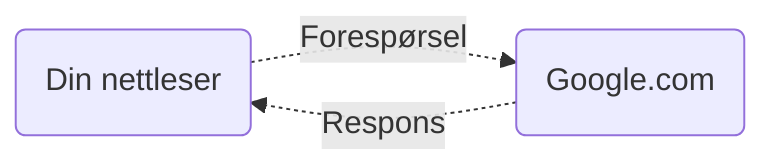
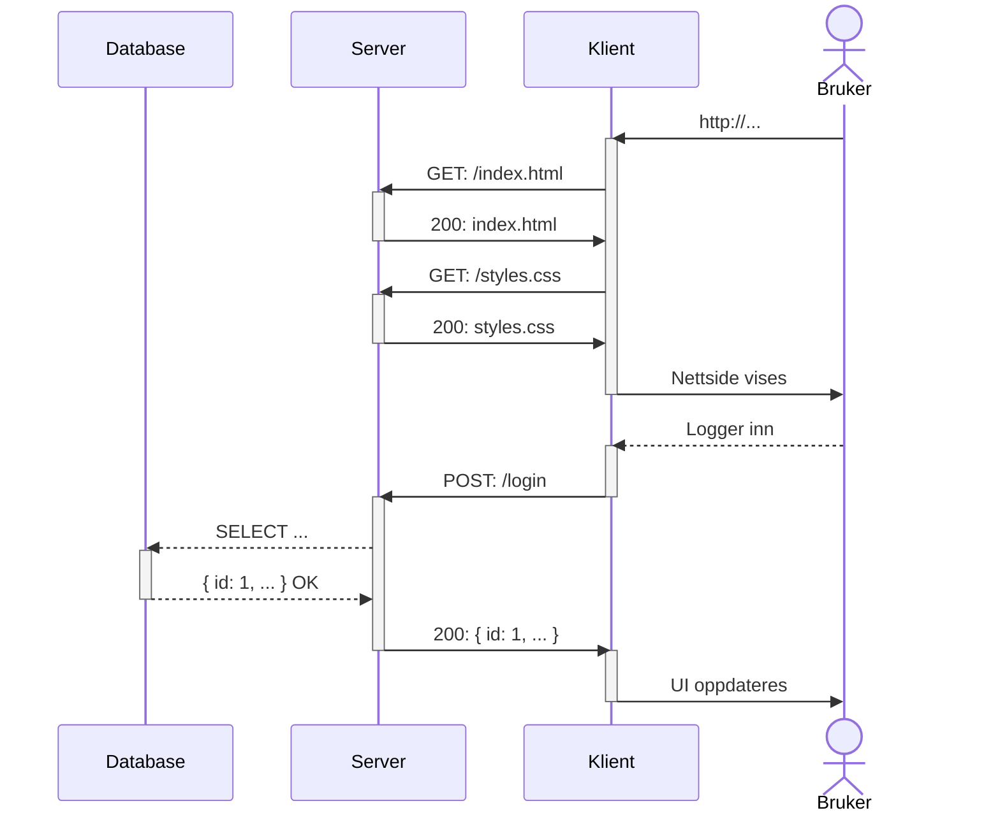

import { IconTitle } from "../../src/components/IconTitle/IconTitle.tsx";

# Server, klient & HTTP

## Introduksjon

Når du åpner en nettside i nettleseren din, så [skjer det en rekke ting i bakgrunnen](./hvordan-fungerer-nettleseren), men det som er viktig å vite er at nettleseren din sender en _forespørsel_ til en _server_ som ligger på en annen datamaskin. Serveren sender så en _respons_ tilbake til nettleseren din, som inneholder nettsiden du ønsker å se.



1. Først sender nettleseren din en _forespørsel_ til nettstedet om å få tilgang til nettsiden.
2. Serveren sender en _respons_ tilbake til klienten med nettsiden sitt innhold.
3. Klienten viser nettsiden til brukeren.

Klienten og server kommuniserer med hverandre over internett ved hjelp av en standard protokoll. Denne protokollen kalles HTTP.

<IconTitle icon="computer">Klient</IconTitle>

Klienten er en applikasjon som kjører på brukerens datamaskin. Den er ansvarlig for å vise brukergrensesnittet og sende forespørsler til serveren.
Dette er som regel nettleseren til brukeren.

<IconTitle icon="server">Server</IconTitle>

Serveren er en applikasjon som kjører på en server-maskin. Den er ansvarlig for å motta forespørsler fra klienten, hente data fra databasen og sende data tilbake til klienten.
En server-maskin er bare en normal datamaskin som er spesielt konfigurert for å kjøre server-applikasjoner, og som er koblet til internett.

<IconTitle icon="database">Database</IconTitle>

Databasen er en applikasjon som kjører på en server-maskin. Den er ansvarlig for å lagre og hente data på en effektiv måte.
Serveren kommuniserer med databasen for å hente og lagre data. Klienten snakker aldri direkte med databasen.

## HTTP

HTTP er en _protokoll_ for å sende data over nettverk. HTTP er basert på forespørsler og svar. En klient sender en forespørsel til en server, og serveren sender et svar tilbake til klienten.

#### HTTPS

HTTPS er en sikker versjon av HTTP. HTTPS krypterer dataene som sendes over nettverket, slik at de ikke kan leses av andre på veien.

### Forespørsel

En forespørsel (request) er en slags melding som klienten sender til serveren. Denne meldingen inneholder informasjon om hva klienten ønsker å gjøre, og er bygget opp av følgende deler:

#### Metode

En forespørsel kan ha en av følgende metoder:

- **`GET`** - Hent data
- **`POST`** - Lagre data, eller utfør en handling
- **`PUT`** & **`PATCH`** - Erstatt eller oppdater data
- **`DELETE`** - Slett data

#### URL

En URL er en adresse som identifiserer en ressurs på en server.

:::info Eksempel
`http://www.example.com/mitt-bilde.png`.
:::

#### Headere

Headere blir brukt til å sende metadata til serveren. En header består av en nøkkel og en verdi. For eksempel:

```http
Accept: text/html
```

#### Body

En forespørsel kan ha en body. En body inneholder data som blir sendt til serveren.

#### Eksempel på forespørsel fra klient til server

```http
GET http://www.example.com/index.html
Accept: text/html
```

I JavaScript kode vil dette typisk se slik ut:

```js
fetch("http://www.example.com/index.html", {
  method: "GET",
  headers: {
    Accept: "text/html",
  },
});
```

### Respons

En respons er et svar fra serveren til klienten. Dette svaret inneholder informasjon om hva som skjedde med forespørselen,
og er bygget opp av en statuskode, headere og en body.

#### Statuskode

En statuskode forteller klienten om forespørselen var vellykket eller ikke. En statuskode kan ha følgende verdier:

- `1xx` - Informasjon
- `2xx` - Suksess
- `3xx` - Omdirigering
- `4xx` - Klientfeil

Et svar med statuskode `200` betyr at forespørselen var vellykket. Et svar med statuskode `404` betyr at ressursen ikke ble funnet.

#### Eksempel på respons fra server til klient

- Status kode:

  ```http
  200 OK
  ```

- Headere:

  ```http
  Access-Control-Allow-Origin: *
  Content-Type: application/json
  ```

- Body (JSON):
  ```json
  {
    "id": 1,
    "name": "Ola Nordmann",
    "age": 42
  }
  ```

Body kan også være HTML, CSS, JavaScript, bilder, videoer, eller andre typer data. JSON er bare en av mange måter å representere data på.
Hvilke type data som sendes blir hintet til av `Content-Type` headeren.

## Visuell representasjon av HTTP



I eksempelet over så skjer det 3 requests:

- Første request er det initielle requestet for å hente nettsiden. Dette requestet er en GET request, og den henter HTML filen som ligger på addressen. Server svarer med HTML-filen.
- Det andre requestet kommer fra HTML filen, og henter CSS filen som ligger på addressen. Server svarer med CSS-filen.
- Det tredje requestet blir sendt ut av JavaScript når bruker logger inn. Dette requestet er en POST request, og den sender brukernavn og passord til serveren. Server svarer med brukerens data, og statuskode 200 (OK).

I tillegg til de 3 requestene så skjer det også en spørring fra server til database.
Dette er en spørring som henter brukerens data fra databasen, og implisitt sjekker om brukernavn og passord er riktig.
Brukeren eksisterer, så da svarer databasen med brukerens data.

Hvis brukeren ikke eksister, så ville serveren svart klienten med statuskode 401 eller 403 (Forbudt / uautorisert).
