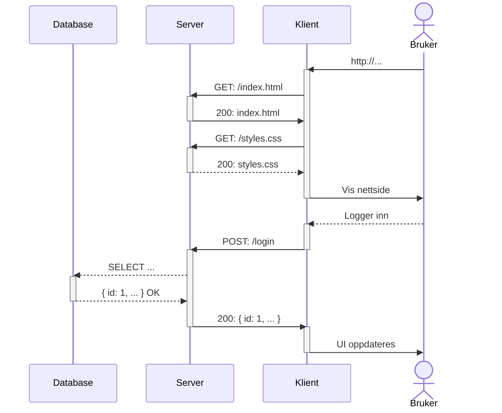

# Server, klient & HTTP

## Aktører

#### Klient

Klienten er en applikasjon som kjører på brukerens datamaskin. Den er ansvarlig for å vise brukergrensesnittet og sende forespørsler til serveren.

#### Server

Serveren er en applikasjon som kjører på en server-maskin. Den er ansvarlig for å motta forespørsler fra klienten, hente data fra databasen og sende data tilbake til klienten.

#### Database

Databasen er en applikasjon som kjører på en server-maskin. Den er ansvarlig for å lagre data.

## HTTP

HTTP er et protokoll for å sende data over nettverk. HTTP er basert på forespørsler og svar. En klient sender en forespørsel til en server, og serveren sender et svar tilbake til klienten.

#### HTTPS

HTTPS er en sikker versjon av HTTP. HTTPS krypterer dataene som sendes over nettverket, slik at de ikke kan leses av andre.

### Forespørsel

En forespørsel ("request") består av en **metode**, en **URL** og et sett med **headere**. En forespørsel kan også inneholde et body.
Svaret blir ofte kalt en respons ("response").

#### Metode

En forespørsel kan ha en av følgende metoder:

- `GET` - Hent data
- `POST` - Lagre data, eller utfør en handling
- `PUT` & `PATCH` - Erstatt eller oppdater data
- `DELETE` - Slett data

#### URL

En URL er en adresse som identifiserer en ressurs på en server. En URL kan ha følgende deler:

- Protokoll: `http://` eller `https://`
- Host: `www.example.com`
- Port: `:80`
- Path: `/index.html`
- Query: `?page=1`
- Fragment: `#section-1`

#### Headere

Headere blir brukt til å sende metadata til serveren. En header består av en nøkkel og en verdi. For eksempel:

```http
Accept: text/html
```

#### Body

En forespørsel kan ha en body. En body inneholder data som blir sendt til serveren.

### Eksempel på forespørsel

```http
GET http://www.example.com/index.html
Accept: text/html
```

I kode vil dette typisk se slik ut:

```js
fetch("http://www.example.com/index.html", {
  method: "GET",
  headers: {
    Accept: "text/html",
  },
});
```

### Svar fra server til klient (respons)

Et svar består av en **statuskode**, et sett med **headere** og en **body**.

#### Statuskode

En statuskode forteller klienten om forespørselen var vellykket eller ikke. En statuskode kan ha følgende verdier:

- `1xx` - Informasjon
- `2xx` - Suksess
- `3xx` - Omdirigering
- `4xx` - Klientfeil

Et svar med statuskode `200` betyr at forespørselen var vellykket. Et svar med statuskode `404` betyr at ressursen ikke ble funnet.

#### Body

Et svar kan ha en body. En body blir brukt til å sende data til klienten, for eksempel HTML, CSS, JavaScript eller JSON.

## Visuell representasjon av HTTP



I eksempelet over så skjer det 3 requests:

- Første request er det initielle requestet for å hente nettsiden. Dette requestet er en GET request, og den henter HTML filen som ligger på addressen. Server svarer med HTML-filen.
- Det andre requestet kommer fra HTML filen, og henter CSS filen som ligger på addressen. Server svarer med CSS-filen.
- Det tredje requestet blir sendt ut av JavaScript når bruker logger inn. Dette requestet er en POST request, og den sender brukernavn og passord til serveren. Server svarer med brukerens data, og statuskode 200 (OK).

I tillegg til de 3 requestene så skjer det også en spørring fra server til database.
Dette er en spørring som henter brukerens data fra databasen, og implisitt sjekker om brukernavn og passord er riktig.
Brukeren eksisterer, så da svarer databasen med brukerens data.

Hvis brukeren ikke eksister, så ville serveren svart klienten med statuskode 401 eller 403 (Forbudt / uautorisert).
